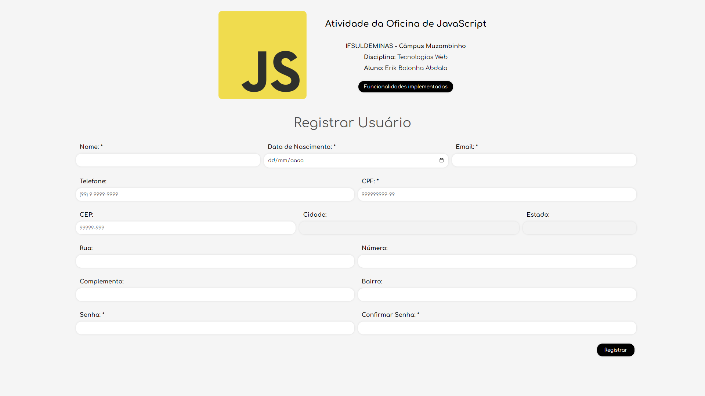

# Atividade da Oficina de JavaScript

Atividade referente à oficina de **JavaScript** ministrada nos dias 28/03, 03/04 e 04/04 como parte da disciplina **Tecnologias Web**. Trata-se de uma página com um formulário no qual foram aplicados diversos tipos de validação para os campos.

**Preview:**

---

**IFSULDEMINAS - Câmpus Muzambinho**  
**Curso:** Ciência da Computação  
**Disciplina:** Tecnologias Web  
**Docente:** Gustavo José  